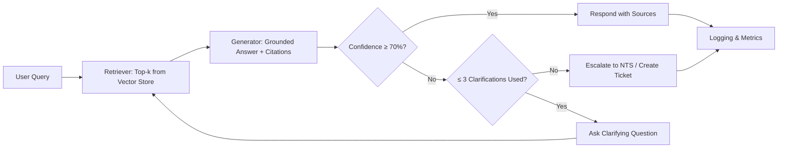

# AGENTS.md

## 1. Overview

**Atticus Agent** is a Retrieval-Augmented Generation (RAG) assistant for FUJIFILM Business Innovation Australia. It answers questions about multifunction devices (MFD) capabilities and performance, citing sources, and escalating low-confidence or ambiguous cases. The agent runs in a Python 3.12 + FastAPI stack, packaged with Docker Compose, and indexes content stored in OneDrive/Azure storage. It operates to enterprise standards for security, evaluation, versioning, and observability.

---

## 2. Core Responsibilities

- **Session Handling**
  - Persist a session ID and anonymized user ID per request.
  - Maintain short conversational memory for follow-up clarifications within a session; never leak past sessions.
- **Answering Rules**
  - Prefer grounded answers with explicit citations (doc + page/section).
  - If retrieval confidence is low or evidence conflicts, trigger clarification or escalation.
  - If a feature is unsupported or unknown, say so plainly and suggest next steps.
- **Escalation Triggers**
  - Confidence < **70%** (see §5).
  - Conflicting sources or unresolved ambiguity after **3** clarification turns.
- **Evaluation**
  - Run automated retrieval and end-to-end Q/A evaluations on each release (see §4).
- **Versioning**
  - Semantic Versioning; block release on evaluation regressions >3% (see §8).
- **Error Logging**
  - Log all exceptions with anonymized request IDs, correlation IDs, and minimal redacted context.

---

## 3. Retrieval & Indexing

- **Supported Formats**
  - PDF (including scanned image PDFs via OCR), DOCX, HTML, and **XLSX Q/A pairs** (Column A = Question, Column B = Answer).
- **Chunking**
  - Target chunk size: **~800–1,000 tokens** with **15–20% overlap**.
  - Respect document structure: headings, tables, captions, and figure references become breadcrumbs.
  - Extract and store: `content`, `breadcrumbs[]`, `headers[]`, `block_type`, `title`, `source_uri`, `page_span`, and `token_count`.
- **Tables & Images**
  - Table cells normalized to row-wise records; preserve header associations.
  - Figures/images: store nearby caption + alt text; link to page anchor for citation.
- **Embedding Model**
  - **text-embedding-3-large** (pinned version) for all embeddings; record **model name + version** with each vector.
- **Ingestion/Re-indexing Pipeline**
  1. **Fetch** from OneDrive/Azure structured content folders.
  2. **Parse** (PDF/DOCX/HTML/XLSX); run OCR where needed.
  3. **Chunk** with overlap and breadcrumbs.
  4. **Embed** with pinned model/version.
  5. **Upsert** into vector store with metadata and checksums.
  6. **Verify** integrity (document count, checksum delta, sample retrieval spot-checks).
  7. **Publish** index atomically (blue/green index alias).

---

## 4. Evaluation & Monitoring

- **Gold Q/A Set**
  - Maintain **50–100** representative Q/A pairs drawn from real staff questions across product lines and document types.
- **Metrics**
  - **nDCG@10**, **Recall@50**, **MRR** — tracked per release and over time.
- **Thresholds**
  - **CI fails** if any metric regresses by **>3%** relative to previous release.
- **Outputs**
  - Write per-run results to CSV (metrics per query and aggregate).
  - Expose a dashboard (e.g., in Grafana/Metabase) for trends: per-metric time series, failure cohorts, and top error categories.

---

## 5. Confidence Thresholds

- **Scoring**
  - Combine retriever scores (e.g., max top-k similarity) with LLM self-check to produce a normalized **0–100%** confidence.
- **Actions**
  - **<70%** → escalate.
  - **≥70% and <80%** → ask for 1–3 clarifying questions; escalate if unresolved after **3** attempts.
  - **≥80%** → answer with citations.
- **Telemetry**
  - Always log the final confidence score, top-k sources used, and whether escalation occurred.

---

## 6. Security & Compliance

- **PII Redaction**
  - Never store raw user prompts; apply PII redaction to logs and traces (emails, phone numbers, serials if customer-identifiable).
- **Data Residency**
  - Content and indices reside in **OneDrive/Azure** storage accounts designated for the project.
- **Identity & Access (Roadmap)**
  - Plan for **AD/SSO** integration; current PoC may use basic auth where strictly necessary.
- **Secrets Handling**
  - No plaintext secrets in code or config; use **environment variables** and secret stores.
- **Audit**
  - Retain audit logs with anonymized IDs and immutable append-only storage for 12+ months.

---

## 7. Runbooks

- **Adding New Docs**
  1. Place files in the appropriate content folder (see §8 folder layout).
  2. Trigger the ingestion job (CLI or CI task).
  3. Verify ingestion report (counts, checksums) and run smoke retrieval (5 random queries).
- **Retraining Embeddings**
  1. Confirm no embedding model/version change; if changed, **full re-embed**.
  2. Rebuild index in a **staging** alias; run full evaluation.
  3. Promote alias if thresholds pass; rollback by flipping alias if not.
- **Running Evaluations**
  1. Ensure gold set freshness.
  2. Execute retrieval and end-to-end Q/A suites.
  3. Export CSV and publish dashboard snapshot; gate release if >3% regression.
- **Rolling Back Releases**
  1. Repoint index alias to previous version.
  2. Revert Docker image tag to prior **X.Y.Z**.
  3. Create a **post-mortem** with root cause and fixes before reinstalling head.

---

## 8. Versioning & Documentation

- **Semantic Versioning**
  - **X.Y.Z** where X=major, Y=minor, Z=patch. Increment on any evaluation-impacting change.
- **Release Checklist**
  - ✅ Ingestion complete
  - ✅ Evaluations pass (no metric regression >3%)
  - ✅ README updated with user-facing steps
  - ✅ CHANGELOG updated with notable changes
  - ✅ Git tag created and pushed
- **Automation (Codex)**
  - On merges affecting pipelines, **auto-update `README.md` and `CHANGELOG.md`** with release notes and version bump.
  - **To-Do Workflow Rule (NEW):**
    - When an item in `ToDo.md` is completed, **mark it complete** in place, and **move the completed item** (with completion date and commit hash) into a separate file **`ToDo-Complete.md`**. Keep `ToDo.md` limited to active items only. This operation should be performed automatically by Codex as part of the PR merge tasks.

---

## 9. Monitoring & Observability

- **Request/Response Logs**
  - Store anonymized request IDs, latency, token usage, top-k doc IDs, and confidence.
- **Metrics**
  - Queries/day, average confidence, clarification rate, escalation rate, answer acceptance rate.
- **Alerts**
  - Alert on escalation spikes, confidence drops, ingestion failures, or evaluation regressions.

---

## 10. Admin Interface

- **Dictionary Maintenance**
  - Curate product and feature synonyms; edits propagate to query rewriting.
- **Session Logs**
  - Browse anonymized sessions, confidence trajectories, and source usage.
- **Error Review**
  - Filter exceptions by type and time; link to traces and failing requests.
- **Evaluation Dashboard**
  - Explore metric trends, cohort breakdowns, and worst-performing queries.

---

## 11. Flowchart

---

## 12. To-Do Backlog

The following are active backlog items; move completed entries to **`ToDo-Complete.md`** per §8.

- **OCR Enhancements**
  - Improve layout-aware OCR for image-heavy PDFs; add table boundary detection.
- **AD/SSO (Roadmap)**
  - Integrate with corporate identity; deprecate any PoC basic auth.
- **Gold Set Expansion**
  - Grow to 100+ Q/A with model coverage, admin/security topics, and common field queries.
- **Grafana/Metabase Integration**
  - Wire evaluation CSVs to a dashboard with alerts on regression.
- **Rollback Playbooks**
  - Expand with failure scenarios and “drills” to rehearse recoveries.

---

### Appendix: Environment & Folders

- **Environment**
  - Python **3.12**, FastAPI, Docker Compose.
  - Vector store of choice with aliasing for blue/green promotion.
- **Content Folder Layout (examples)**
  - `content/model/AC7070/`
  - `content/software/Papercut/`
  - `content/model/generic/`
  - `content/service/`
- **XLSX Q/A Conventions**
  - `Sheet1`: **A** = Question, **B** = Answer (A2+B2 = first pair). Validate non-empty cells; trim whitespace.

---

**Governance Note:** This document is authoritative. Agents and automations act without approval gates, but all actions are observable, reversible, and measured.
