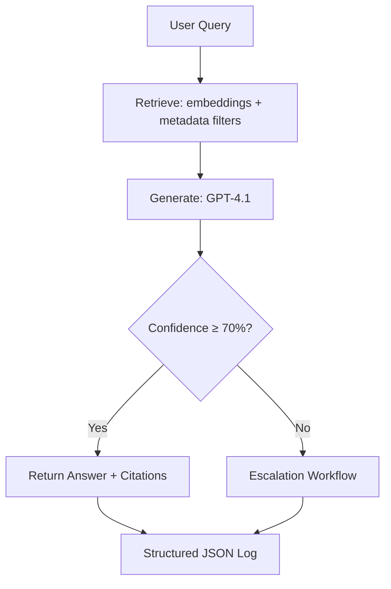

# AGENTS.md

## 1. Overview
Atticus is a Retrieval-Augmented Generation (RAG) agent focused on FUJIFILM MFD capability and performance queries. It combines curated content ingestion, robust retrieval, and controlled generation with enterprise standards for versioning, evaluation, observability, and compliance.

- **Default runtime:** Python **3.12**
- **Default embedding model:** `text-embedding-3-large` (pinned)
- **Default LLM:** `gpt-4.1` (pinned)
- **Storage:** OneDrive/Azure (data residency enforced)

---

## 2. Core Responsibilities
- **Session handling:** Maintain short-lived conversational context; expire by policy.
- **Answering rules:** Always cite retrieved sources where applicable; prefer concise, factual responses.
- **Escalation triggers:** Confidence < **70%** or **3** unsuccessful clarification attempts.
- **Evaluation & versioning:** Run metric suite per release; block if regression > **3%**.
- **Error logging:** Record all failures and anomalies using **structured JSON** logs.

---

## 3. Retrieval & Indexing
**Supported formats**
- PDF, DOCX, XLSX Q/A pairs, HTML, scanned images (OCR).

**Chunking rules**
- Target ~**512 tokens** with **~20% overlap**.
- Preserve table structure (HTML/CSV fallback) and capture figure captions; OCR for images/diagrams.

**Embedding**
- `text-embedding-3-large` (pinned exact version in config).
- Store embedding model version alongside index metadata.

**Indexing pipeline (high-level)**
1. Ingest → 2. Parse/normalize → 3. Chunk → 4. Embed → 5. Persist (vector + metadata) → 6. Validate (spot-check recall) → 7. Activate index.

**Modeling defaults & fine-tuning**
- **LLM:** `gpt-4.1` for generation.
- **Fine-tuning:** **OpenAI SFT** (supervised fine-tuning) is supported for domain adaptation (curated examples only).
- **LoRA:** Excluded for now (not applicable to closed-weight OpenAI hosted models). Revisit only if adopting open-weight models.

### 3.1 Content Folder Structure (maintained)
Atticus expects a stable, documented taxonomy for ingestion. Maintain the following structure under `content/`:

```
content/
  model/
    AC7070/                # Model-specific assets (brochures, specs, admin guides)
    generic/               # Shared model guidance (e.g., security whitepapers)
  software/
    Papercut/              # Print mgmt integrations, setup, compatibility
  service/                 # Service bulletins, reference guides, troubleshooting
```

**Rules**
- Keep atomic documents (no mixed unrelated topics).
- Prefer original source PDFs and companion CSV/HTML tables when available.
- Name files with stable prefixes: `YYYYMMDD_topic_version.ext` for traceability.

---

## 4. Evaluation & Monitoring
**Gold set**
- Maintain **50–100** Q/A pairs drawn from real queries; keep sources and page refs.

**Metrics**
- **nDCG@10**
- **Recall@50**
- **MRR**

**Thresholds & execution**
- **CI fails** if any metric regresses by **>3%** vs. baseline.
- Evaluation harness implemented with **pytest**; exports **CSV** artifacts and publishes to dashboards.

---

## 5. Confidence Thresholds
- **Escalate** when confidence < **70%**.
- **Escalate** after **3** clarification attempts.
- **Always log** the numeric confidence with every answer and store alongside request metadata.

---

## 6. Security & Compliance
- **PII redaction** in logs and evaluation artifacts.
- **Data residency:** Content and derived indices remain in **OneDrive/Azure**.
- **Identity roadmap:** Plan **Azure AD/SSO** integration.
- **Secrets:** No plaintext. Use environment variables and secret stores only.

---

## 7. Runbooks
**Adding new docs**
1. Place files under `content/` using the taxonomy in §3.1.
2. Run ingestion: parse → chunk → embed → index.
3. Spot-check retrieval with ad-hoc queries; commit index manifest.

**Retraining embeddings**
1. Sync/modify `content/`.
2. Re-run chunking + embedding.
3. Validate against gold set; publish metrics.

**Running evaluations**
1. `pytest -m eval` (or provided task).
2. Compare to baseline CSV; block if >3% regression.
3. Archive run artifacts under `evaluation/runs/YYYYMMDD/`.

**Rollback releases**
1. Identify last **tagged** stable release.
2. Restore previous **index snapshot** and **model config**.
3. Invalidate caches; run smoke tests (top-N gold queries).
4. Tag the rollback and update `CHANGELOG.md`.

---

## 8. Versioning & Documentation
- **Semantic Versioning:** `X.Y.Z`
  - **X**: incompatible changes
  - **Y**: features (backward-compatible)
  - **Z**: fixes/evals/docs
- **Release checklist**
  - Pass eval thresholds
  - Update `CHANGELOG.md` (auto via Codex)
  - Update `README.md` (install, runbooks, metrics)
  - Create git tag and attach eval artifacts summary

---

## 9. Monitoring & Observability
- **Logs:** Structured JSON (request, retrieved chunks, answer, confidence, latency).
- **Metrics:** queries/day, avg confidence, escalations/day, latency percentiles.
- **Alerts:** Notify on escalation spikes (rate-of-change), confidence dips, error bursts.
- **Dashboards:** Azure Monitor / Grafana (targets documented in infra config).

---

## 10. Admin Interface
- **Dictionary/Synonyms:** Curate domain terms and aliases to improve recall.
- **Session logs:** Review anonymized interactions and escalations.
- **Error review:** Categorize parsing/indexing/generation issues.
- **Evaluation dashboard:** Trend nDCG@10, Recall@50, MRR by release.

---

## 11. Flowchart


---

## 12. To-Do Backlog
- Expand OCR strategies for image-heavy PDFs (layout-aware + table reconstruction).
- AD/SSO integration (Azure Entra) for admin tools.
- Grow gold set to >100 items and stratify by topic.
- Grafana integration for live metrics.
- Rollback automation scripts (index snapshots + config pins).
- OpenAI **SFT** pilot on high-value Q/A; codify data hygiene and consent.
- Periodic taxonomy audit for `content/` to reduce drift.

---

### Repository Layout (reference)
```
atticus/
  content/                 # Ingestion corpus (see §3.1)
    model/AC7070/
    model/generic/
    software/Papercut/
    service/
  evaluation/
    gold_set.csv
    runs/                  # Dated eval outputs
    harness/               # pytest suites, configs
  docs/
    AGENTS.md
    README.md
  logs/
    app.jsonl              # Structured logs (rotated)
```

---

## Notes on Fine-Tuning
- **Preferred:** **OpenAI SFT** for GPT-4.1 using curated, consented examples.
- **Not in scope:** LoRA adapters (not applicable to OpenAI hosted GPT-4.1).
- All SFT datasets must exclude sensitive/regulated data and include provenance.
