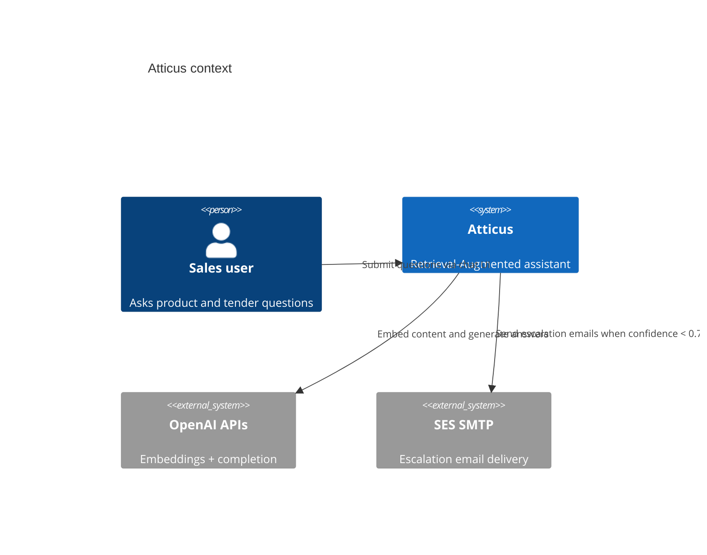
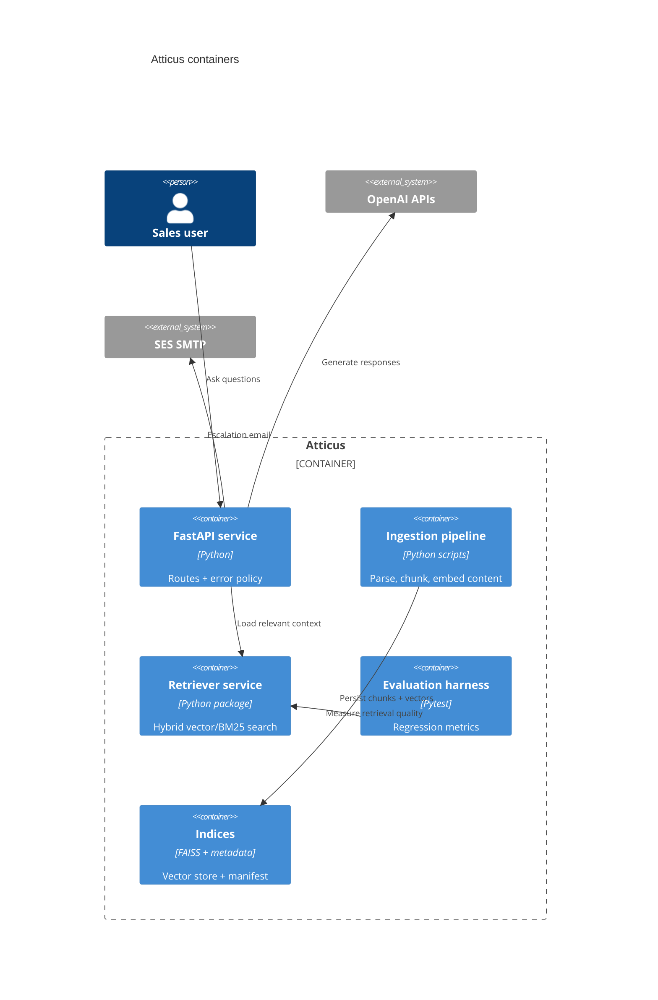

# System Overview (Explanation)

This guide explains how Atticus ingests content, retrieves and ranks evidence, generates grounded answers,
and handles ambiguous questions or low confidence scenarios. Use it alongside [README.md](../../README.md) for
setup steps and [OPERATIONS.md](../../OPERATIONS.md) for runbooks.

---

## System Walkthrough

1. **Content Intake** – Place source files under `content/` using the `YYYYMMDD_topic_version.ext`
   convention and record metadata in `indices/manifest.json` during ingestion.
2. **Chunking & Embedding** – `make ingest` honours `CHUNK_TARGET_TOKENS`, `CHUNK_MIN_TOKENS`, and
   `CHUNK_OVERLAP_TOKENS` before generating embeddings with the configured `EMBED_MODEL`.
3. **Index Persistence** – FAISS artefacts plus rich metadata (page number, heading, breadcrumb) live in
   `indices/`, while `logs/app.jsonl` captures counts, durations, and token stats for every run.
4. **Retrieval** – Queries compose dense similarity with BM25 lexical scores. Optional reranking (see
   [ENABLE_RERANKER](#re-ranking-and-hybrid-retrieval)) boosts passages that align semantically, lexically,
   and via fuzzy matching.
5. **Answer Generation** – Ranked chunks feed the generator client (`GEN_MODEL`, default `gpt-4.1`), which
   returns concise responses with inline citations.
6. **Confidence & Escalation** – Retrieval and LLM confidence are blended. Scores below `CONFIDENCE_THRESHOLD`
   trigger cautious answers and `should_escalate=True` so callers can notify humans.
7. **UI Integration** – FastAPI serves the UI at `/` and exposes interactive docs at `/docs`.
   `tests/test_ui_route.py` verifies templates render and static assets respond.

---

## Handling Ambiguous Questions

1. **Retriever safeguards** – Hybrid retrieval honours `MAX_CONTEXT_CHUNKS`, preventing noisy long contexts.
2. **Generator resilience** – Heuristic confidence drops when evidence is weak, encouraging escalation.
3. **Escalation workflow** – Combine low-confidence answers with `POST /contact` to alert human reviewers.
4. **Recommended playbook** – Add disambiguation examples to `content/`, rerun `make ingest`, and monitor
   `make eval` metrics for regression.

---

## Re-ranking and Hybrid Retrieval

- Toggle via environment variable `ENABLE_RERANKER=1` (see [README.md](../README.md#environment)).
- Weighted scoring per chunk: 55% vector similarity (cosine/IP transformed to 0–1), 25% normalized BM25, 20%
  fuzzy overlap (RapidFuzz `partial_ratio`).
- The reranker reorders candidates before the generator sees any context, improving grounding for
  keyword-heavy tenders.
- Leave disabled for very small corpora or strictly semantic workloads.

---

## SMTP Dry Run Mode

- Set `SMTP_DRY_RUN=1` to log escalation attempts without sending email.
- The mailer emits an `escalation_email_dry_run` event containing host/port details while redacting
  recipients.
- Use this for CI, demos, or credential verification.

---

## Remote Access Patterns

Pick the approach that fits your environment and follow [Remote Access](../how-to/remote-access.md) for step-by-step
instructions covering Tailscale, Cloudflare Tunnel, and SSH reverse tunnels.

---

## Deployment-to-Release Checklist

1. Run `make fmt`, `make lint`, `make type`, `make test` (coverage target ≥90%).
2. Execute `make ingest` after content updates; commit `indices/manifest.json` if shipping new knowledge.
3. Run `make eval` and compare metrics against the latest baseline in `eval/baseline.json`.
4. Update `CHANGELOG.md` and `RELEASE.md` with highlights.
5. Tag with SemVer and push; GitHub Actions repeats the same quality gates.

---

## Feature Gaps vs. EXAMPLES_ONLY

`EXAMPLES_ONLY/` showcases patterns not yet in Atticus. Future opportunities include:

- Real-time Socket.IO progress events for ingestion/eval status.
- Knowledge base crawling UI with background scheduling (see `crawling-configuration.mdx`).
- MCP tool integration for multi-service workflows (`mcp-overview.mdx`).
- Collaborative project room management inspired by `projects-overview.mdx`.
- Observability dashboards similar to `server-monitoring.mdx` (service health, queue depth, alerts).

Track these items in [TODO.md](../TODO.md#future-enhancements-from-examples_only) for prioritisation.

---

## Quick Reference

| Task | Command |
|------|---------|
| Generate `.env` | `make env` |
| Ingest new content | `make ingest` |
| Run evaluation harness | `make eval` |
| Launch API + UI | `make api` |
| Regenerate OpenAPI schema | `make openapi` |
| Trigger dry-run escalation | `SMTP_DRY_RUN=1 python -m atticus.notify.mailer` |
| Run full quality gate | `make quality` |

For operational depth, see [OPERATIONS.md](../OPERATIONS.md) and [TROUBLESHOOTING.md](../TROUBLESHOOTING.md).
