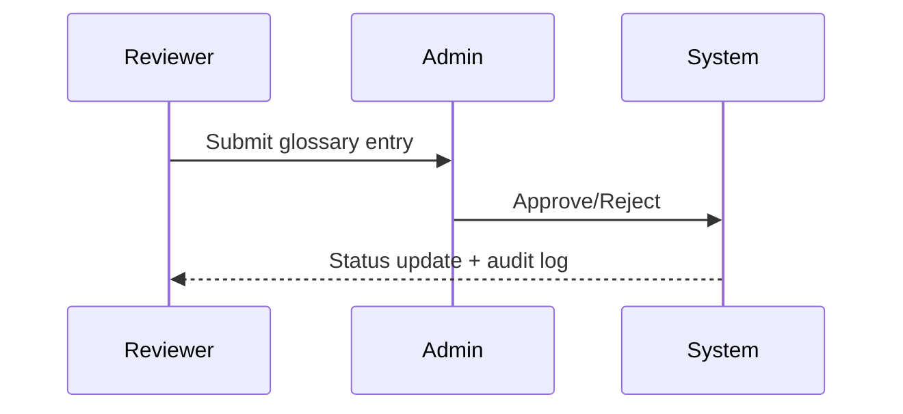

# Glossary Specification

The glossary module enables reviewers to propose terminology updates and administrators
to approve or reject entries. The workflow is designed to mirror the RBAC policies in the
Next.js admin UI and Prisma models.

## Roles

| Role       | Permissions                                                |
| ---------- | ---------------------------------------------------------- |
| `user`     | Read-only access to approved glossary entries.             |
| `reviewer` | Submit new terms and propose edits.                        |
| `admin`    | Approve/reject proposals, manage history, export glossary. |

## Data Model

```prisma
model GlossaryEntry {
  id           String          @id @default(cuid())
  term         String
  definition   String          @db.Text
  synonyms     String[]        @default([])
  status       GlossaryStatus  @default(PENDING)
  orgId        String
  org          Organization    @relation(fields: [orgId], references: [id], onDelete: Cascade)
  authorId     String
  author       User            @relation("GlossaryAuthor", fields: [authorId], references: [id])
  updatedById  String?
  updatedBy    User?           @relation("GlossaryUpdatedBy", fields: [updatedById], references: [id])
  reviewerId   String?
  reviewer     User?           @relation("GlossaryReviewer", fields: [reviewerId], references: [id])
  reviewNotes  String?         @db.Text
  reviewedAt   DateTime?
  createdAt    DateTime        @default(now())
  updatedAt    DateTime        @updatedAt

  @@unique([orgId, term])
  @@index([orgId, status])
}
```

All mutations emit structured audit logs (see `logs/app.jsonl`) including the acting user,
the request/trace ID, and the state transition. Row-level security is enforced through
Prisma queries executed inside `withRlsContext` and mirrored on the FastAPI admin APIs via
the `X-Admin-Token` header.

## API Contracts

- `GET /api/glossary` – reviewer/admin session required; returns serialized entries with
  author/reviewer metadata.
- `POST /api/glossary` – admin session required; accepts term, definition, synonyms, and
  status updates, recording author/reviewer metadata and request IDs.
- FastAPI `/admin/dictionary` endpoints mirror the glossary state for legacy tooling and
  require a matching `X-Admin-Token` header; failures emit contract-compliant error
  payloads with `request_id` for observability.

## UI Flow

1. Reviewer submits a new term with synonyms and rationale.
2. Admin views pending proposals on `/admin/glossary`, reviews the diff, and approves.
3. Approved entries become available to all users and propagate via the API contract.

### Sequence Diagram



### Decision Notes

- **Single admin review gate** keeps quality control centralized and aligns with our RBAC policy where only admins can approve or
  reject terms. This mirrors the Prisma ownership model and prevents conflicting reviewer decisions.
- **Audit-first feedback** relies on structured events written during each transition so downstream services can reconcile glossary
  changes without polling Prisma directly.
- **FastAPI bridge retained** to support legacy tooling that still depends on the `/admin/dictionary` endpoints during the migration
  period.

### Follow-ups

- Reviewer/admin notifications for status changes remain open in the backlog — tracked in [TODO.md §5](../TODO.md#5-uncertain-chat-validation-flow).
- Dedicated audit UI enhancements live under [TODO.md §4](../TODO.md#4-admin-ops-console-uncertain-chats-tickets-glossary) alongside the combined admin console workstream.

## Seed Data & Provisioning

- `make db.seed` provisions:
  - Organization `org-atticus` (overridable via `DEFAULT_ORG_ID`).
  - Service users `glossary.author@seed.atticus` (reviewer) and `glossary.approver@seed.atticus` (admin) for deterministic RBAC checks.
  - Three glossary rows covering the primary workflow states:
    - `glossary-entry-managed-print-services` → **APPROVED** with reviewer metadata for smoke tests.
    - `glossary-entry-proactive-maintenance` → **PENDING** awaiting admin action.
    - `glossary-entry-toner-optimization` → **REJECTED** with notes capturing why it failed review.
- Re-running the seed is idempotent: each entry is upserted by stable IDs and the reviewer/author assignments are refreshed.
- Override defaults (organization name, admin bootstrap account, etc.) by exporting `DEFAULT_ORG_NAME`, `ADMIN_EMAIL`, and `ADMIN_NAME` before invoking the target.

## Reset & Rollback

- To reset the glossary to the deterministic baseline:
  1. `make db.seed` — reruns Prisma seeding and restores the canonical entries.
  2. Confirm via `pytest tests/test_seed_manifest.py::test_glossary_seed_entries_round_trip` (requires a reachable Postgres instance).
- To restore production data after testing seeds:
  1. Snapshot `GlossaryEntry` rows (e.g., `COPY "GlossaryEntry" TO STDOUT WITH CSV HEADER`).
  2. After validation, re-import using `COPY ... FROM STDIN` or Prisma scripts, then rerun `make db.seed` to ensure support accounts persist.
- Rollbacks should always re-run `make db.seed` so the deterministic reviewers remain available for smoke suites.

## CI Expectations

- `make test.api` exercises glossary endpoints under auth.
- `make quality` enforces type checks on the Prisma client and Next.js components.
- Seed data for glossary lives alongside the CED seed manifest (`make seed`).
