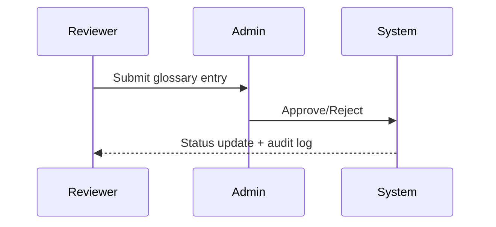

# Glossary Specification

The glossary module enables curators to propose terminology updates and the dedicated
admin service to approve or reject entries. Identity and access control are enforced at
the network boundary; the chat surface is read-only while the admin workspace (port 9000)
provides the review tooling.

## Service Responsibilities

- **Chat service (port 3000)** &mdash; consumes approved glossary entries to render highlights
  and definitions. It never mutates glossary data.
- **Admin service (port 9000)** &mdash; surfaces review queues, allows edits, and writes audit
  events via the shared Prisma models.

## Data Model

```prisma
model GlossaryEntry {
  id           String          @id @default(cuid())
  term         String
  definition   String          @db.Text
  synonyms     String[]        @default([])
  aliases           String[] @default([])
  units             String[] @default([])
  productFamilies   String[] @default([])
  normalizedAliases String[] @default([])
  normalizedFamilies String[] @default([])
  status       GlossaryStatus  @default(PENDING)
  orgId        String
  org          Organization    @relation(fields: [orgId], references: [id], onDelete: Cascade)
  authorId     String
  author       User            @relation("GlossaryAuthor", fields: [authorId], references: [id])
  updatedById  String?
  updatedBy    User?           @relation("GlossaryUpdatedBy", fields: [updatedById], references: [id])
  reviewerId   String?
  reviewer     User?           @relation("GlossaryReviewer", fields: [reviewerId], references: [id])
  reviewNotes  String?         @db.Text
  reviewedAt   DateTime?
  events       RagEvent[]
  createdAt    DateTime        @default(now())
  updatedAt    DateTime        @updatedAt

  @@unique([orgId, term])
  @@index([orgId, status])
}
```

All mutations emit structured `RagEvent` audit rows (mirrored in `logs/app.jsonl`) including the acting user,
the request/trace ID, and the state transition. Row-level security is enforced through
Prisma queries executed inside `withRlsContext`; the admin service forwards the trusted gateway
headers and does not require any shared tokens.

## API Contracts

- `GET /api/glossary` – exposed to the trusted chat surface; returns serialized entries with
  author metadata plus glossary fields (aliases, units, normalized product families) used by the UI.
- `POST /api/glossary` – called by the admin service; idempotent upsert keyed by `(orgId, term)`
  that accepts term, definition, synonyms, aliases, units, product families, and status updates
  while recording author/reviewer metadata and request IDs.
- `PUT /api/glossary/:id` – admin service update that edits an entry in place (definition,
  synonyms, aliases, units, product families, status, review notes). Normalized aliases/families
  are recomputed server-side to keep chat lookups consistent.
- FastAPI `/admin/dictionary` endpoints mirror the glossary state for legacy tooling and are
  reachable only from the trusted network segment; failures emit contract-compliant error
  payloads with `request_id` for observability.

## UI Flow

1. Reviewer submits a new term with synonyms and rationale.
2. Admin views pending proposals on `/admin/glossary`, edits definitions inline, captures review notes, and approves.
3. Approved entries become available to all users and propagate via the API contract. The
   chat surface inspects glossary metadata on every response and renders inline highlights for
   matched terms, including aliases, canonical units, and normalized product families.

### Sequence Diagram



### Decision Notes

- **Single admin review gate** keeps quality control centralized and mirrors the service split:
  only the admin workspace can approve or reject terms, preventing conflicting reviewer decisions.
- **Audit-first feedback** relies on structured events written during each transition so downstream services can reconcile glossary
  changes without polling Prisma directly.
- **FastAPI bridge retained** to support legacy tooling that still depends on the `/admin/dictionary` endpoints during the migration
  period.

### Follow-ups

- Reviewer/admin notifications for status changes remain open in the backlog — tracked in [TODO.md §5](../TODO.md#5-uncertain-chat-validation-flow).
- Dedicated audit UI enhancements live under [TODO.md §4](../TODO.md#4-admin-ops-console-uncertain-chats-tickets-glossary) alongside the combined admin console workstream.

## Seed Data & Provisioning

- `make db.seed` provisions:
  - Organization `org-atticus` (overridable via `DEFAULT_ORG_ID`).
  - Service users `glossary.author@seed.atticus` and `glossary.approver@seed.atticus` for deterministic audit trails in tests.
  - Three glossary rows covering the primary workflow states:
    - `glossary-entry-managed-print-services` → **APPROVED** with reviewer metadata for smoke tests.
    - `glossary-entry-proactive-maintenance` → **PENDING** awaiting admin action.
    - `glossary-entry-toner-optimization` → **REJECTED** with notes capturing why it failed review.
- Re-running the seed is idempotent: each entry is upserted by stable IDs and the reviewer/author assignments are refreshed.
- Override defaults (organization name, admin bootstrap account, etc.) by exporting `DEFAULT_ORG_NAME`, `ADMIN_EMAIL`, and `ADMIN_NAME` before invoking the target.

## Reset & Rollback

- To reset the glossary to the deterministic baseline:
  1. `make db.seed` — reruns Prisma seeding and restores the canonical entries.
  2. Confirm via `pytest tests/test_seed_manifest.py::test_glossary_seed_entries_round_trip` (requires a reachable Postgres instance).
- To restore production data after testing seeds:
  1. Snapshot `GlossaryEntry` rows (e.g., `COPY "GlossaryEntry" TO STDOUT WITH CSV HEADER`).
  2. After validation, re-import using `COPY ... FROM STDIN` or Prisma scripts, then rerun `make db.seed` to ensure support accounts persist.
- Rollbacks should always re-run `make db.seed` so the deterministic reviewers remain available for smoke suites.

## CI Expectations

- `make test.api` exercises glossary endpoints under auth.
- `make quality` runs Prisma client type checks, Vitest coverage, and Playwright admin flows to guard glossary access.
- Seed data for glossary lives alongside the CED seed manifest (`make seed`).
